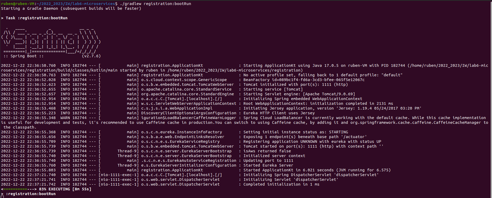
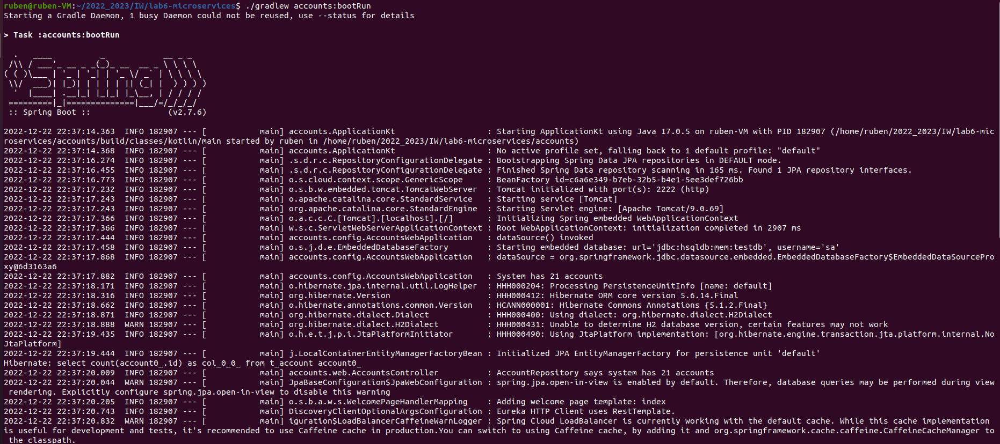
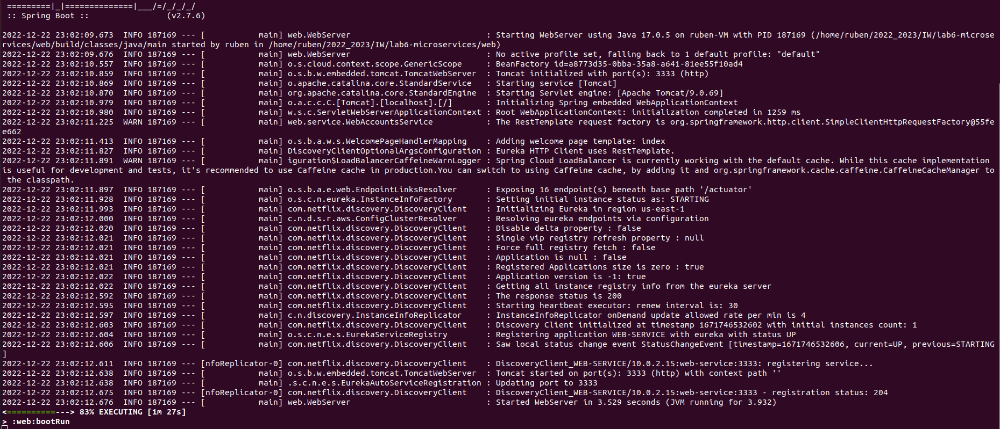
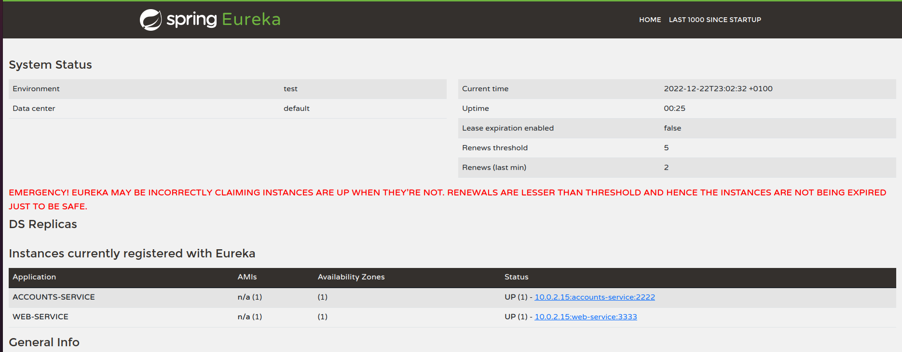
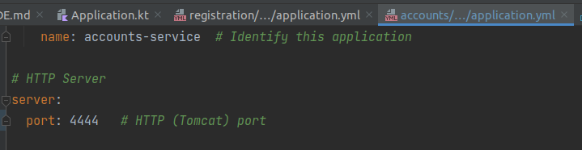
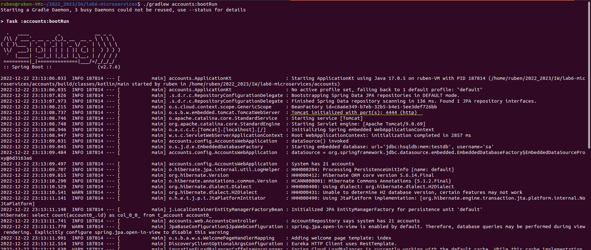
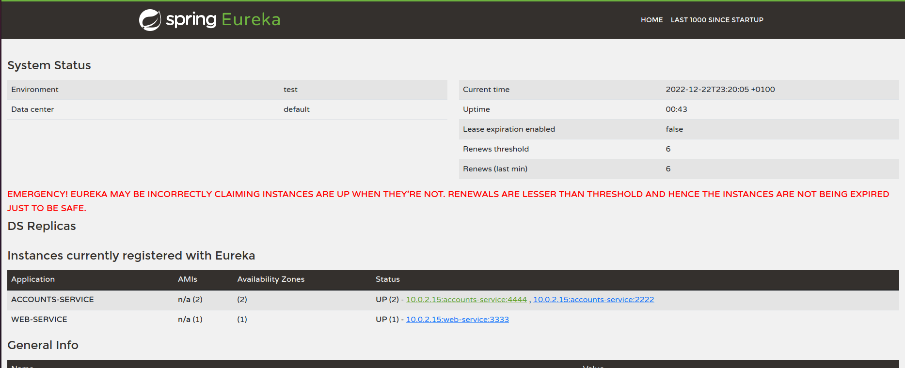
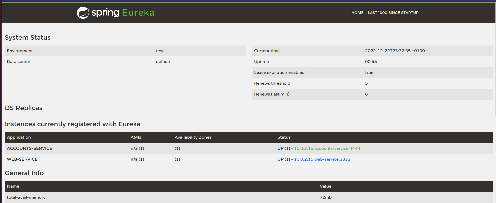
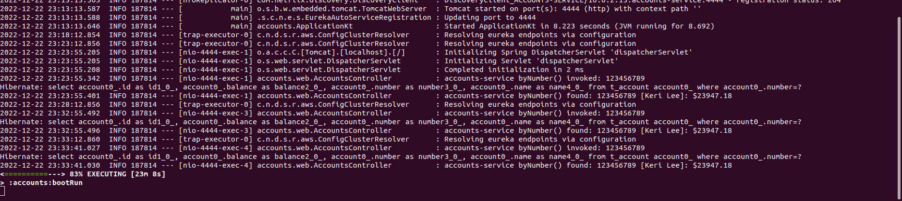

# Lab 6 Report - Microservices

## Introduction
Lab objective is to show that the next steps are accomplished. To achieve that, it will be used
a Spring project based on microservices. This project has the next apps:

- `registration app`, which launches the Eureka server, exposed in `http://localhost:1111`
- `accounts app`, a standalone process that provides a RESTful server to a repository of
accounts that will use the port 2222.
- `web app`, a standalone process that provides an MVC front-end to the application of accounts that will use the port 3333.

## The accounts (2222) and web are running and registered
First, we run the registration service. We can do this executing
`./gradlew registration:bootRun`

Next, we run an account service after that on a separate terminal with `./gradlew accounts:bootRun`

And the web service on another terminal with `./gradlew web:bootRun`

Finally, we can see Eureka working in `http://localhost:1111`. Dashboard shows both account and web services registered
in the registration service.

## Second accounts service instance is started, use port 4444 and is registered
Now we have to edit accounts app application.yml with port 4444.

Next we execute again an account service with the new port.

In the end we reload Eureka, where now the second account will be registered.

## What happens when you kill the service accounts (2222) and do requests to web?
Let's see and stop the account service with port 2222. If we update, Eureka now shows
that account 2222 is not registered.

But if we try to use the web service, the account information is retrieved from account service 4444.

## Can the web service provide information about the accounts again? Why?
It does, as we can see. This happens because web service doesn't look for a specific account service, so as long as still exists
one account(4444 in this case) the web service will work.